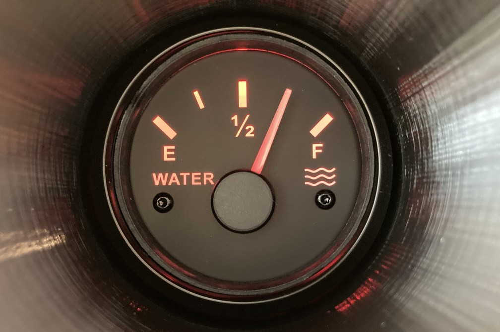

*Copyright (C) 2022, Axis Communications AB, Lund, Sweden. All Rights Reserved.*

# OPC UA Gauge Reader ACAP

[](https://github.com/AxisCommunications/opc-ua-gaugereader-acap/actions/workflows/build.yml)
[](https://github.com/AxisCommunications/opc-ua-gaugereader-acap/actions/workflows/super-linter.yml)



This repository contains the source code to build a small example
[ACAP version 3](https://help.axis.com/acap-3-developer-guide)
application that reads an analogue gauge using video analytics with
[OpenCV](https://opencv.org/)
and exposes the value through a built-in
[OPC UA](https://en.wikipedia.org/wiki/OPC_Unified_Architecture)
([open62541](https://open62541.org/)) server.


The exposed value is in percent.

*Please note that even if this ACAP would fit right into your usecase, its
purpose is above all to serve as an example and boilerplate rather than being
ready for production.*

## Example Use Cases

> The following examples assume that you have a [SCADA](https://en.wikipedia.org/wiki/SCADA) (Supervisory
Control And Data Acquisition) system or a [PLC](https://en.wikipedia.org/wiki/Programmable_logic_controller) (Programmable Logic Controller) system with OPC UA as the communication protocol and you want to take advantage of the Axis device capabilities to enrich or complement your operations.

Analogue gauges are common in the industry, and it is often impossible to add
digital sensors due to regulations or warranty restrictions. However, having a
human operator monitor these gauges (which is what is done today) is
inconvenient and error-prone. Instead, we can use an IP camera with very basic
video analysis to automatically capture the digital reading and feed it into
the industrial system. Automating the capture of digital values from analog
gauges opens up a multitude of possibilities.

For example:

- shutdown or start a PLC process if a gauge reading exceeds or falls below a specified threshold
- generate alarms when the gauge reading goes outside a predefined range
- display real-time gauge values within the SCADA server's operational interface
- maintain historical logs of gauge values to track changes over time

> [!WARNING]
> Please note that any analytic process can never be 100% accurate and the system designer has to account for this.

## Build

The build process uses the
[ACAP SDK build container](https://hub.docker.com/r/axisecp/acap-sdk)
and Docker.

The Docker commands are integrated in the [Makefile](Makefile), so if you have
Docker and `make` on your computer all you need to do is:

```sh
make dockerbuild
```

or perhaps build in parallel:

```sh
make -j dockerbuild
```

If you do have Docker but no `make` on your system:

```sh
# 32-bit ARM, e.g. ARTPEC-6- and ARTPEC-7-based devices
DOCKER_BUILDKIT=1 docker build --build-arg ARCH=armv7hf -o type=local,dest=. .
# 64-bit ARM, e.g. ARTPEC-8-based devices
DOCKER_BUILDKIT=1 docker build --build-arg ARCH=aarch64 -o type=local,dest=. .
```

## Debug

If you would like the application to store the images from each step in the
video analysis to disk for debugging, set the `DEBUG_WRITE` variable for the
build:

```sh
DEBUG_WRITE=y make -j dockerbuild
```

or

```sh
# 32-bit ARM, e.g. ARTPEC-6- and ARTPEC-7-based devices
DOCKER_BUILDKIT=1 docker build --build-arg DEBUG_WRITE=y --build-arg ARCH=armv7hf -o type=local,dest=. .
# 64-bit ARM, e.g. ARTPEC-8-based devices
DOCKER_BUILDKIT=1 docker build --build-arg DEBUG_WRITE=y --build-arg ARCH=aarch64 -o type=local,dest=. .
```

## Setup

### Manual installation and configuration

Upload the ACAP file (the file with the `.eap` extension for the camera's
architecture) through the camera's web UI: *Apps->Add app*

When installed, start the ACAP.


Open the ACAP's settings page in the web interface (available when the ACAP is
running) by clicking the *Open* button.


In the settings page, simply click in the image to set up the calibration
points in the following order:

1. Center of the gauge
1. Minimum value of the gauge
1. Maximum value of the gauge

The calibration points can also, along with the OPC UA Server port (default is
4840) and clockwise/counterclockwise (default is clockwise), be set directly
through the ACAP's parameter settings, found in the three vertical dots menu:


### Scripted installation and configuration

Use the camera's
[applications/upload.cgi](https://www.axis.com/vapix-library/subjects/t10102231/section/t10036126/display?section=t10036126-t10010609)
to upload the ACAP file (the file with the `.eap` extension for the camera's
architecture):

```sh
curl -k --anyauth -u root:<password> \
    -F packfil=@OPC_UA_Gauge_Reader_<version>_<architecture>.eap \
    https://<camera hostname/ip>/axis-cgi/applications/upload.cgi
```

To
[start (or stop/restart/remove)](https://www.axis.com/vapix-library/subjects/t10102231/section/t10036126/display?section=t10036126-t10010606)
the ACAP, you can make a call like this:

```sh
curl -k --anyauth -u root:<password> \
    'https://<camera hostname/ip>/axis-cgi/applications/control.cgi?package=opcuagaugereader&action=start'
```

Use the camera's
[param.cgi](https://www.axis.com/vapix-library/subjects/t10175981/section/t10036014/display)
to set the center/min/max points, as well as clockwise/counterclockwise and the
OPC UA server port number.

The call

```sh
curl -k --anyauth -u root:<password> \
    'https://<camera hostname/ip>/axis-cgi/param.cgi?action=list&group=opcuagaugereader'
```

will list the current settings:

```sh
root.Opcuagaugereader.centerX=479
root.Opcuagaugereader.centerY=355
root.Opcuagaugereader.clockwise=1
root.Opcuagaugereader.maxX=678
root.Opcuagaugereader.maxY=165
root.Opcuagaugereader.minX=283
root.Opcuagaugereader.minY=167
root.Opcuagaugereader.port=4840
```

If you want to set the OPC UA server port to e.g. 4842:

```sh
curl -k --anyauth -u root:<password> \
    'https://<camera hostname/ip>/axis-cgi/param.cgi?action=update&opcuagaugereader.port=4842'
```

## Usage

Attach an OPC UA client to the port set in the ACAP. The client will then be
able to read the value (and its timestamp) from the ACAP's OPC UA server.

The ACAP will also log the gauge value in the camera's syslog.

## License

[Apache 2.0](LICENSE)
